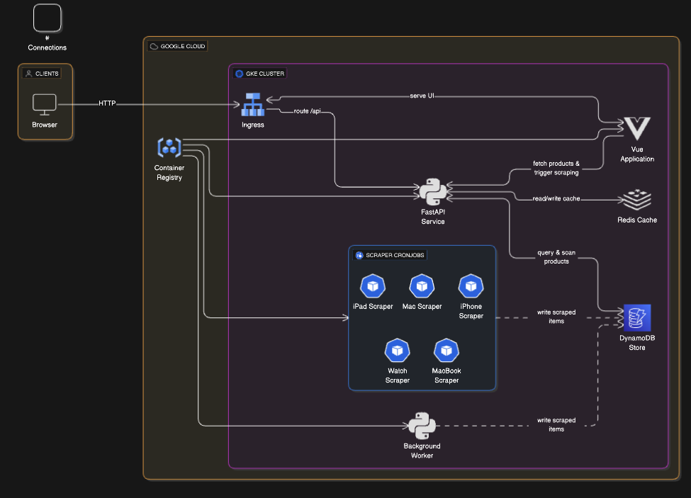

# 📦 Distributed Apple Web Scraper

Distribuirani sustav za automatski scraping cijena Apple proizvoda (iPhone, Mac, MacBook, iPad, Watch) s više izvora. Sustav podržava pametno prepoznavanje kategorija, raspoređivanje scraping poslova putem task queuea (Redis + RQ), keširanje, paralelno izvršavanje spidera i orkestraciju putem Kubernetes-a (Google Kubernetes Engine - GKE).

---

## 🔧 Tehnologije

- **FastAPI** – REST backend za upravljanje scraping zahtjevima i dohvat podataka
- **Scrapy** – scraper framework za dohvat podataka s weba
- **Redis + RQ (Redis Queue)** – task queue za raspodjelu scraping poslova i keširanje
- **DynamoDB (local)** – NoSQL baza za pohranu podataka o proizvodima
- **Vue.js** – jednostavan frontend za pretraživanje i prikaz proizvoda
- **Kubernetes (GKE)** – kontejnera i skalabilnost, horizontalno skaliranje i cron scraping
- **Docker** – kontejnerizacija svih komponenti sustava

---

## 🧱 Arhitektura

---

## ✅ Glavne funkcionalnosti

### 📤 `POST /api/scraper?keyword=...`

Automatski prepoznaje kategoriju iz korisničkog unosa (npr. "iphone 16 pro max") i enqueue-a odgovarajući spider.

### 📥 `GET /api/products?category=...`

Vraća proizvode iz Redis cache (ako postoji) ili iz DynamoDB baze.

### 📌 `POST /api/run-spider/{spider_name}`

Ručno pokretanje određenog spidera (npr. mac_spider, iphone_spider).

## 🧠 Pametno prepoznavanje kategorije

Primjer prepoznatog unosa :

| Input korisnika       | Pozvani spider   |
| --------------------- | ---------------- |
| `iphone 16 pro max`   | `iphone_spider`  |
| `macbook pro 14 m2`   | `macbook_spider` |
| `apple watch ultra 2` | `iwatch_spider`  |

Korištenjem fuzzy matching algoritma, backend prepoznaje najsličniju kategoriju i aktivira odgovarajući spider.

---

## ☁️ Kubernetes Deployment (GKE)

### Servisi:

- `frontend-deployment.yaml`
- `backend-deployment.yaml`
- `dynamodb-deployment.yaml`
- `redis-deployment.yaml`
- `spider-worker-deployment.yaml`

---

## ⚡ Optimizacije

- ✔ Pametno mapiranje kategorija iz slobodnog teksta
- ✔ Paralelno pokretanje više spidera
- ✔ Keširanje rezultata po kategorijama u Redis-u
- ✔ Asinkrono raspoređivanje poslova preko Redis Queue (RQ)
- ✔ CronJob za periodično pokretanje spidera

---

## 📌 TODO (daljnje nadogradnje)

- [ ] Koristi scrapy-ai umjesto klasičnog
- [ ] Status scraping poslova (job_id) + polling
- [ ] Pagination i sortiranje rezultata na frontend sučelju
- [ ] Dodavanje još izvora
- [ ] Koristi plaćenu verziju google clouda
- [ ] Koristiti plaćenu bazu

---

## 🧑‍💻 Pokretanje lokalno

---

## Organizacija

Fakultet informatike u Puli

Raspodijeljeni sustavi, ak.god. 2024./2025. Mentor: Nikola Tanković (https://fipu.unipu.hr/fipu/nikola.tankovic, nikola.tankovic@unipu.hr)

---
